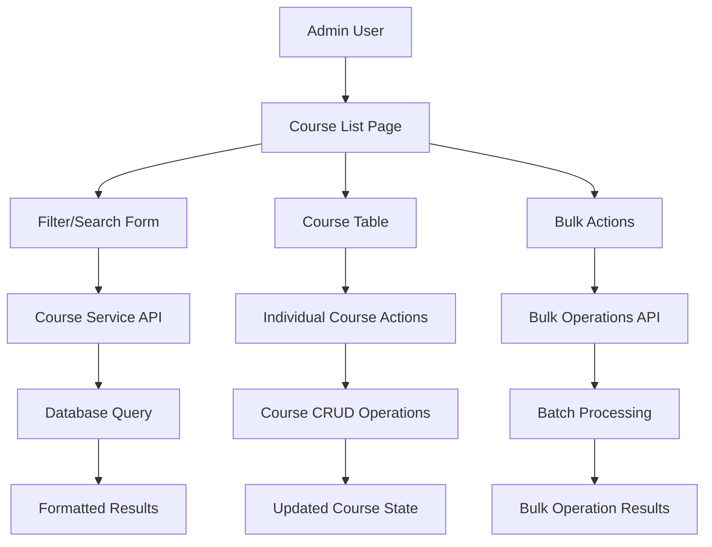

# T066: Admin Course Management Architecture Guide

## Introduction

This guide covers the comprehensive course management system implemented for the admin interface. T066 represents a sophisticated approach to building scalable, user-friendly administrative tools for content management systems.

## Architecture Overview

### 1. Multi-Layer Architecture

```
┌─────────────────────────────────────┐
│           Presentation Layer        │
│  (Admin Courses List Interface)     │
├─────────────────────────────────────┤
│           Business Logic Layer      │
│     (Course Service + Validation)   │
├─────────────────────────────────────┤
│           Data Access Layer         │
│    (Database + API Endpoints)       │
├─────────────────────────────────────┤
│           Infrastructure Layer      │
│   (Authentication + Authorization)  │
└─────────────────────────────────────┘
```

**Key Benefits:**
- Clear separation of concerns
- Testable and maintainable codebase
- Scalable architecture for future features
- Consistent error handling across layers

### 2. Component Interaction Flow



## Key Design Patterns

### 1. Repository Pattern Implementation

```typescript
// Course filtering interface
interface CourseFilterOptions {
  page?: number;
  limit?: number;
  search?: string;
  category?: string;
  isPublished?: boolean;
  sortBy?: 'createdAt' | 'title' | 'price' | 'enrollmentCount';
  sortOrder?: 'ASC' | 'DESC';
}

// Service layer abstraction
const result = await listCourses(filterOptions);
```

**Benefits:**
- Abstracted data access logic
- Consistent filtering interface
- Easy to test and mock
- Reusable across different contexts

### 2. State Management Pattern

```javascript
// Centralized state management for bulk operations
function updateSelectAllState() {
  const checkedCount = Array.from(courseCheckboxes).filter(cb => cb.checked).length;
  const totalCount = courseCheckboxes.length;
  
  if (checkedCount === 0) {
    selectAllCheckbox.checked = false;
    selectAllCheckbox.indeterminate = false;
  } else if (checkedCount === totalCount) {
    selectAllCheckbox.checked = true;
    selectAllCheckbox.indeterminate = false;
  } else {
    selectAllCheckbox.checked = false;
    selectAllCheckbox.indeterminate = true;
  }
}
```

**Key Features:**
- Centralized state updates
- Proper indeterminate state handling
- Event-driven state synchronization
- Predictable state transitions

### 3. Progressive Enhancement Pattern

```astro
<!-- Base functionality works without JavaScript -->
<form method="GET" class="filter-form">
  <input type="text" name="search" value={search} />
  <select name="category">
    <option value="">All Categories</option>
    <!-- Options populated server-side -->
  </select>
  <button type="submit">Filter</button>
</form>

<!-- Enhanced with JavaScript for better UX -->
<script>
  // Add debounced search, AJAX filtering, etc.
</script>
```

**Benefits:**
- Works without JavaScript
- Enhanced experience with JavaScript
- Accessible to all users
- SEO-friendly server-side rendering

## User Experience Design

### 1. Information Architecture

```
Course Management Dashboard
├── Statistics Overview
│   ├── Total Courses
│   ├── Published Count
│   ├── Draft Count
│   └── Total Enrollments
├── Filtering & Search
│   ├── Text Search
│   ├── Category Filter
│   ├── Status Filter
│   └── Sort Options
├── Course Listing
│   ├── Course Preview Cards
│   ├── Individual Actions
│   └── Bulk Selection
└── Pagination Controls
    ├── Page Navigation
    ├── Results Summary
    └── Page Size Options
```

### 2. Interaction Design Principles

**Immediate Feedback:**
```typescript
// Provide instant visual feedback for user actions
button.addEventListener('click', async (e) => {
  const target = e.target as HTMLButtonElement;
  target.disabled = true;
  target.textContent = 'Processing...';
  
  try {
    await performAction();
    showSuccessMessage();
  } catch (error) {
    showErrorMessage();
  } finally {
    target.disabled = false;
    target.textContent = 'Original Text';
  }
});
```

**Confirmation Patterns:**
```astro
<!-- Modal confirmation for destructive actions -->
<div id="delete-modal" class="modal">
  <div class="modal-content">
    <h3>Delete Course</h3>
    <p>Are you sure you want to delete "<span id="course-title"></span>"?</p>
    <div class="actions">
      <button id="confirm-delete" class="danger">Delete</button>
      <button id="cancel-delete">Cancel</button>
    </div>
  </div>
</div>
```

### 3. Accessibility Implementation

**Keyboard Navigation:**
```javascript
// Ensure all interactive elements are keyboard accessible
document.addEventListener('keydown', (e) => {
  if (e.key === 'Enter' || e.key === ' ') {
    const target = e.target;
    if (target.matches('[data-keyboard-action]')) {
      e.preventDefault();
      target.click();
    }
  }
});
```

**Screen Reader Support:**
```astro
<!-- Proper ARIA labels and descriptions -->
<button 
  aria-label="Delete course: {course.title}"
  aria-describedby="delete-help-text"
  data-testid="delete-course"
>
  Delete
</button>
<div id="delete-help-text" class="sr-only">
  This action cannot be undone
</div>
```

## Data Management Strategies

### 1. Efficient Querying

```typescript
// Optimized database queries with proper indexing
interface CourseQuery {
  // Use database indexes for common filter combinations
  where: {
    title?: { contains: string, mode: 'insensitive' };
    category?: string;
    isPublished?: boolean;
  };
  orderBy: {
    [key: string]: 'asc' | 'desc';
  };
  skip: number;
  take: number;
  include: {
    // Only include necessary relations
    _count: {
      select: { enrollments: true, reviews: true };
    };
  };
}
```

### 2. Caching Strategy

```typescript
// Multi-level caching for performance
class CourseListCache {
  private static cache = new Map();
  private static CACHE_TTL = 5 * 60 * 1000; // 5 minutes
  
  static async getCourses(filters: CourseFilterOptions) {
    const cacheKey = JSON.stringify(filters);
    const cached = this.cache.get(cacheKey);
    
    if (cached && Date.now() - cached.timestamp < this.CACHE_TTL) {
      return cached.data;
    }
    
    const data = await fetchCoursesFromDB(filters);
    this.cache.set(cacheKey, { data, timestamp: Date.now() });
    return data;
  }
}
```

### 3. Real-time Updates

```javascript
// WebSocket integration for real-time course updates
const courseSocket = new WebSocket('/ws/courses');

courseSocket.onmessage = (event) => {
  const { type, data } = JSON.parse(event.data);
  
  switch (type) {
    case 'COURSE_UPDATED':
      updateCourseInList(data.courseId, data.changes);
      break;
    case 'COURSE_DELETED':
      removeCourseFromList(data.courseId);
      break;
    case 'ENROLLMENT_CHANGED':
      updateEnrollmentCount(data.courseId, data.newCount);
      break;
  }
};
```

## Performance Optimization

### 1. Client-Side Optimizations

**Debounced Search:**
```javascript
let searchTimeout;
searchInput.addEventListener('input', (e) => {
  clearTimeout(searchTimeout);
  searchTimeout = setTimeout(() => {
    performSearch(e.target.value);
  }, 300);
});
```

**Virtual Scrolling for Large Lists:**
```javascript
class VirtualScrollList {
  constructor(container, itemHeight, totalItems) {
    this.container = container;
    this.itemHeight = itemHeight;
    this.totalItems = totalItems;
    this.visibleStart = 0;
    this.visibleEnd = 0;
  }
  
  render() {
    const scrollTop = this.container.scrollTop;
    const containerHeight = this.container.clientHeight;
    
    this.visibleStart = Math.floor(scrollTop / this.itemHeight);
    this.visibleEnd = Math.min(
      this.visibleStart + Math.ceil(containerHeight / this.itemHeight) + 1,
      this.totalItems
    );
    
    this.renderVisibleItems();
  }
}
```

### 2. Server-Side Optimizations

**Database Query Optimization:**
```sql
-- Optimized query with proper indexes
CREATE INDEX idx_courses_list_view ON courses (
  is_published, 
  category, 
  created_at DESC,
  title
);

-- Efficient pagination query
SELECT courses.*, COUNT(enrollments.id) as enrollment_count
FROM courses 
LEFT JOIN enrollments ON courses.id = enrollments.course_id
WHERE courses.is_published = $1 
  AND courses.category = $2
  AND courses.title ILIKE $3
GROUP BY courses.id
ORDER BY courses.created_at DESC
LIMIT $4 OFFSET $5;
```

**Response Caching:**
```typescript
// Redis caching for frequent queries
const cacheKey = `courses:${JSON.stringify(filters)}`;
const cached = await redis.get(cacheKey);

if (cached) {
  return JSON.parse(cached);
}

const result = await database.query(filters);
await redis.setex(cacheKey, 300, JSON.stringify(result)); // 5 min cache
return result;
```

## Security Implementation

### 1. Authorization Patterns

```typescript
// Role-based access control
async function checkCourseManagementAccess(user: User) {
  if (!user.isAdmin && !user.permissions.includes('MANAGE_COURSES')) {
    throw new ForbiddenError('Insufficient permissions for course management');
  }
}

// Course ownership validation
async function validateCourseAccess(courseId: string, userId: string) {
  const course = await getCourse(courseId);
  if (course.instructorId !== userId && !user.isAdmin) {
    throw new ForbiddenError('Cannot modify courses you do not own');
  }
}
```

### 2. Input Validation

```typescript
// Comprehensive input validation
const CourseFilterSchema = z.object({
  page: z.number().min(1).max(1000).optional(),
  limit: z.number().min(1).max(100).optional(),
  search: z.string().max(100).optional(),
  category: z.enum(['Manifestation', 'Energy Healing', ...]).optional(),
  isPublished: z.boolean().optional(),
  sortBy: z.enum(['createdAt', 'title', 'price', 'enrollmentCount']).optional(),
  sortOrder: z.enum(['ASC', 'DESC']).optional(),
});

export function validateFilters(filters: unknown) {
  return CourseFilterSchema.parse(filters);
}
```

### 3. CSRF Protection

```astro
<!-- CSRF token in forms -->
<form method="POST" action="/api/admin/courses/bulk">
  <input type="hidden" name="_token" value={csrfToken} />
  <input type="hidden" name="action" value="delete" />
  <input type="hidden" name="courseIds" value={selectedIds} />
  <button type="submit">Delete Selected</button>
</form>
```

## Testing Strategies

### 1. Component Testing

```typescript
// Testing individual components
describe('CourseCard Component', () => {
  test('displays course information correctly', () => {
    const course = createMockCourse();
    render(<CourseCard course={course} />);
    
    expect(screen.getByText(course.title)).toBeInTheDocument();
    expect(screen.getByText(course.description)).toBeInTheDocument();
    expect(screen.getByText(`$${course.price / 100}`)).toBeInTheDocument();
  });
  
  test('handles publish toggle correctly', async () => {
    const onToggle = jest.fn();
    const course = createMockCourse({ isPublished: false });
    
    render(<CourseCard course={course} onTogglePublish={onToggle} />);
    
    await user.click(screen.getByText('Publish'));
    expect(onToggle).toHaveBeenCalledWith(course.id, true);
  });
});
```

### 2. Integration Testing

```typescript
// Testing API integration
describe('Course Management API', () => {
  test('should filter courses correctly', async () => {
    await createTestCourses();
    
    const response = await request(app)
      .get('/api/admin/courses')
      .query({ category: 'Manifestation', isPublished: true })
      .expect(200);
    
    expect(response.body.courses).toHaveLength(2);
    expect(response.body.courses.every(c => c.category === 'Manifestation')).toBe(true);
  });
});
```

### 3. E2E Testing Patterns

```typescript
// Page Object Model for maintainable E2E tests
class CoursesListPage {
  constructor(private page: Page) {}
  
  async searchCourses(term: string) {
    await this.page.fill('[data-testid="search-input"]', term);
    await this.page.click('[data-testid="search-button"]');
    await this.page.waitForLoadState('networkidle');
  }
  
  async selectCourse(courseId: string) {
    await this.page.check(`[data-course-id="${courseId}"] input[type="checkbox"]`);
  }
  
  async deleteCourse(courseId: string) {
    await this.page.click(`[data-course-id="${courseId}"] [data-testid="delete-button"]`);
    await this.page.click('#confirm-delete');
    await this.page.waitForLoadState('networkidle');
  }
}
```

## Maintenance and Monitoring

### 1. Error Tracking

```typescript
// Comprehensive error logging
class CourseManagementLogger {
  static logError(operation: string, error: Error, context?: any) {
    console.error(`Course Management Error [${operation}]:`, {
      message: error.message,
      stack: error.stack,
      context,
      timestamp: new Date().toISOString(),
      userId: context?.user?.id,
    });
    
    // Send to monitoring service
    Sentry.captureException(error, { tags: { operation }, extra: context });
  }
  
  static logPerformance(operation: string, duration: number, context?: any) {
    console.info(`Course Management Performance [${operation}]:`, {
      duration: `${duration}ms`,
      context,
      timestamp: new Date().toISOString(),
    });
  }
}
```

### 2. Health Monitoring

```typescript
// Health check endpoint for course management
app.get('/health/courses', async (req, res) => {
  try {
    const start = Date.now();
    
    // Test database connectivity
    await database.query('SELECT 1');
    
    // Test cache connectivity
    await cache.ping();
    
    // Test basic course query
    await listCourses({ page: 1, limit: 1 });
    
    const duration = Date.now() - start;
    
    res.json({
      status: 'healthy',
      checks: {
        database: 'ok',
        cache: 'ok',
        courseQuery: 'ok',
      },
      responseTime: `${duration}ms`,
      timestamp: new Date().toISOString(),
    });
  } catch (error) {
    res.status(503).json({
      status: 'unhealthy',
      error: error.message,
      timestamp: new Date().toISOString(),
    });
  }
});
```

## Best Practices Summary

### 1. Code Organization
- **Separation of Concerns:** Keep presentation, business logic, and data access separate
- **Single Responsibility:** Each component should have one clear purpose
- **DRY Principle:** Avoid duplicating logic across components
- **Consistent Naming:** Use clear, descriptive names for variables and functions

### 2. User Experience
- **Progressive Enhancement:** Build core functionality first, enhance with JavaScript
- **Accessibility First:** Design for keyboard navigation and screen readers
- **Performance:** Optimize for fast loading and smooth interactions
- **Error Handling:** Provide clear feedback for all user actions

### 3. Security
- **Input Validation:** Validate all user input on both client and server
- **Authorization:** Check permissions for every sensitive operation
- **CSRF Protection:** Use tokens to prevent cross-site request forgery
- **Audit Logging:** Log all administrative actions for security review

### 4. Testing
- **Unit Tests:** Test individual components in isolation
- **Integration Tests:** Test component interactions and API integration
- **E2E Tests:** Test complete user workflows across browsers
- **Performance Tests:** Verify system performance under load

## Future Considerations

### 1. Scalability Improvements
- Implement database sharding for large course catalogs
- Add CDN integration for course thumbnails and assets
- Consider GraphQL for more efficient data fetching
- Implement micro-frontend architecture for team scalability

### 2. Feature Enhancements
- Real-time collaboration for multi-admin editing
- Advanced analytics dashboard integration
- Automated course quality scoring
- AI-powered course recommendations

### 3. Technical Debt Management
- Regular dependency updates and security patches
- Performance monitoring and optimization
- Code quality metrics and automated refactoring
- Documentation updates and architectural reviews

---

This guide serves as a comprehensive reference for understanding, maintaining, and extending the course management system. The patterns and practices documented here should be applied consistently across the entire admin interface for maximum effectiveness and maintainability.